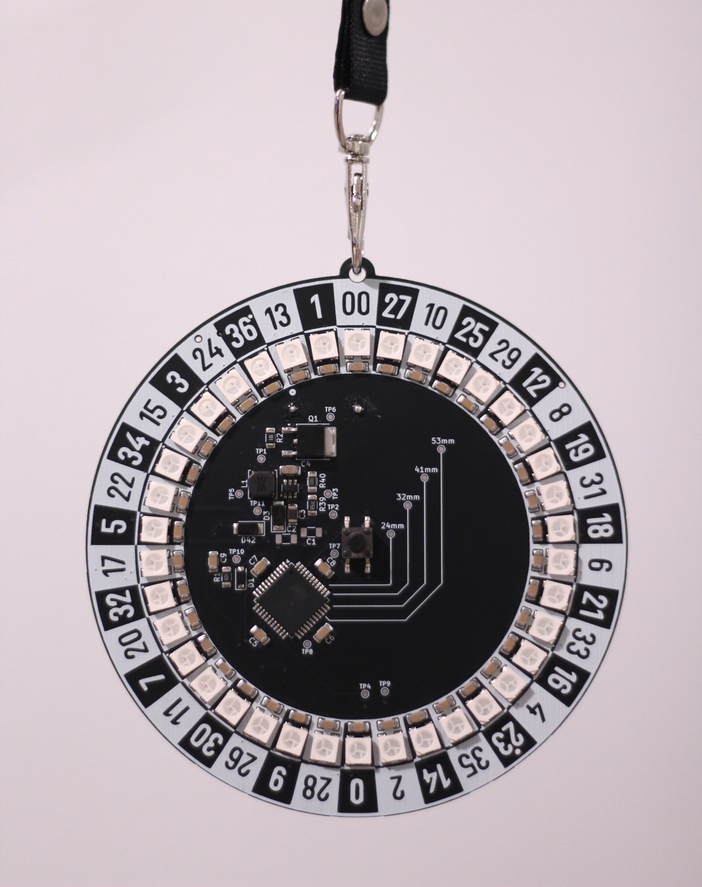

# Roulette Badge

This repo contains the firmware for a badge I designed and sold at WWHF Mile High 2025. It turned out pretty sick and I'm very proud of the project :)

<center>

</center>

## Usage

This section reiterates information found in an insert given to purchasers the badge. 

### Controls

* Push button once to spin wheel

* Quickly push button twice to switch animation

    * Manually switching animation will disable auto changing of animations

* Hold button to enter brightness configuration

    * Push button to change brightness level

    * Once desired brightness is selected, do nothing for a few seconds to exit brightness configuration

* Hold button while turning badge on to play qStacker

    * Press button when blue cursor is aligned with red tower

### Other Info

* Badge takes 3xAAA Batteries for power

* Before first use, remove paper insert from battery pack

* Large contacts on the back of badge are protected from short circuits, contacts on the front less so, avoid bridging contacts on the badge if possible

## Development

This project is largely written using the ATmega32A Arduino core [MightyCore](https://github.com/MCUdude/MightyCore). Control of the LEDS is done using [FastLED](https://github.com/FastLED/FastLED). 

**VERY IMPORTANT PROGRAMMING NOTE:** While the badge is designed to be able to power all LEDs at white, full brightness, I recommend against running the LEDs that high as I did not test it very much and it will also drain batteries very quickly. Even at very low brightness the LEDs are very bright, the default brightness I use in FastLED is only `5`.

## Flashing

To modify and flash this project to the board, [PlatformIO IDE](https://platformio.org/platformio-ide) is required. As I am writing this on a slight time crunch, I will not go in depth about getting PlatformIO up and running, and instead recommend looking at any of the many PlatformIO tutorials out there that will likely explain it a lot better than I would anyways.

The microcontroller in use on the board is an ATmega32A. Whilst the board does not have a built in USB to serial adapter or anything similar, there are programming pads on the back of the board designed to have aligator clips attached to them. 

### Flashing Bootloader

**NOTE:** If you bought this badge from me, then it already has a bootloader flashed to it. You should only need to flash a new bootloader if you're doing some huge modifications, in which case I recommend already knowing enough that you don't need this section of the README (:P). 

To flash the bootloader, the `RESET`, `MISO`, `MOSI`, and `SCK` pins are used. If using an Arduino UNO as an ISP programmer, the pin connections are as follows:

* Any 5V pin to `5V`
* Any ground pin to `GND`
* UNO pin 10 to `RESET`
* UNO pin 11 to `MOSI`
* UNO pin 12 to `MISO`
* UNO pin 13 to `SCK`

The bootloader can then either be flashed using Arduino IDE (using the Arduino as IPS option) or through the PlatformIO project. If programming through the PlatformIO project, you may have to modify the `platformio.ini` file to set the path of your programmer (if on Linux, this is likely /dev/ttyACM0 or something similar, if on Windows, this is one of the COM ports). The default fuse/bootloader flags are as follows:

```
board_hardware.oscillator = internal
board_bootloader.type = urboot
board_bootloader.speed = 38400
board_hardware.uart = uart0
board_hardware.bod = 2.7v
board_hardware.eesave = yes
board_build.f_cpu = 8000000L ; 8MHz 
```

These flags can be mirrored in the Arduino IDE if flashing the bootloader that way.

If using the PlatformIO IDE, run `Burn Bootloader` under `fuses_bootloader`, if using the Arduino IDE, run `Tools > Burn Bootloader` with the programmer set to `Arduino as ISP`.

### Flashing Program

To flash non-bootloader firmware, the `DTR`, `TX`, and `RX` pins are used. `DTR` is used to automatically reset the board for programming, whatever serial adapter you use will likely have this pin exposed in some form. 

Serial connections are as follows:

* Any 5V supply to `5V`
* Ground to `GND`
* Serial programmer TX to `RX`
* Serial programmer RX to `TX`
* Serial programmer DTR to `DTR`

You may need to modify the `upload_port` variable under `env:Upload_UART` in `platformio.ini` to match the path of your serial programmer (if on Linux, it is likely /dev/ttyUSB0 or similar, and if on Windows, it is likely a COM port).

Next, just modify the project in the PlatformIO IDE and flash it by running `Uploade` under `Upload_UART`.

## Final Notes

I am writing much of this right before WWHF, so sorry if some if it is a bit messy. Thank you so much for checking out the project, and an even bigger thanks if you bought one of the badges. 